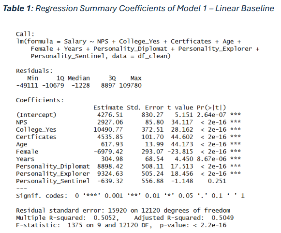

Personal portfolio of my data analytics projects

# Western Canada Retired Ties Project - CPKC Rail
* Spearheaded the development of a comprehensive business case for Retired Rail ties that forecasted a
10-20% reduction in disposal costs.
* Assessed the viability of my proposed project through detailed financial modeling, projecting a CostBenefit analysis over a 10-year time frame.
* Created an in-depth implementation plan using predictive modeling, demonstrating feasibility and
outlining milestones in the project’s integration.

# Technology Sales Regression Analysis - Dhillon School of Business
* Determined the most influential factors that drive compensation, refining pay structure to address
budget constraints and ensure competitiveness in the market.
* Communicated recommendations and next steps for decision-making and deployment.

